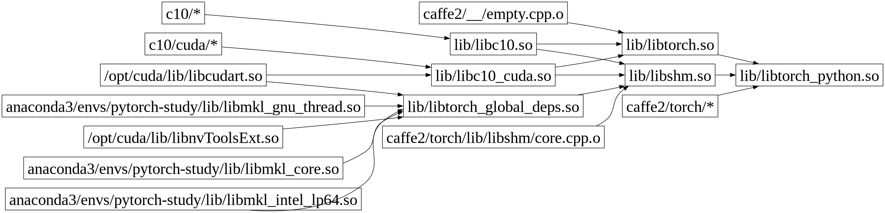

## Module dependencies


## Build
```sh
$ git submodule sync
$ git submodule update --init --recursive
 
$ conda create -y -n pytorch-study python=3.9
$ conda activate pytorch-study
 
$ conda install -y cmake ninja
$ pip install -r requirements.txt

$ conda install -y mkl mkl-include
$ conda install -y -c pytorch magma-cuda121

$ conda install -y gcc_linux-64=11.2.0
$ conda install -y gxx_linux-64=11.2.0
$ echo $PATH | tr ":" "\n"
/home/tk/anaconda3/envs/pytorch-study/bin
/usr/bin
...
$ # there is a bug in cmake that calls `gcc' directly.
$ # here we need to make sure the conda-version gcc is used.
$ # because the above output indicates conda-PATH is still
$ # prioritized than the /usr/bin, we can do:

$ cd $CONDA_PREFIX/bin
$ ln -s x86_64-conda-linux-gnu-gcc gcc
$ ln -s x86_64-conda-linux-gnu-g++ g++
$ cd -

$ nvidia-smi | grep CUDA
NVIDIA-SMI 535.54.03
Driver Version: 535.54.03
CUDA Version: 12.2
$ conda install -y -c nvidia/label/cuda-12.1.1 cuda
$ env | grep CUDA
CUDA_PATH=/opt/cuda
$ unset CUDA_PATH

$ echo $CMAKE_PREFIX_PATH | tr ":" "\n"
/home/tk/anaconda3/envs/pytorch-study
/home/tk/anaconda3/envs/pytorch-study/x86_64-conda-linux-gnu/sysroot/usr
$ python setup.py develop
```

Optionally, delete the `easy_install` link so that we do not mistake the local torch package:
```sh
$ rm -f $CONDA_PREFIX/lib/python3.9/site-packages/easy-install.pth
```

Show installed Pytorch information:
```sh
$ ls torch/lib
cmake                        libjitbackend_test.so  libtensorpipe.a
libXNNPACK.a                 libkineto.a            libtensorpipe_cuda.a
libasmjit.a                  libnnpack.a            libtensorpipe_uv.a
libbackend_with_compiler.so  libprotobuf-lite.a     libtorch.so
libc10.so                    libprotobuf.a          libtorch_cpu.so
libc10_cuda.so               libprotoc.a            libtorch_cuda.so
libc10d_cuda_test.so         libpthreadpool.a       libtorch_cuda_linalg.so
libcaffe2_nvrtc.so           libpytorch_qnnpack.a   libtorch_global_deps.so
libclog.a                    libqnnpack.a           libtorch_python.so
libcpuinfo.a                 libshm                 libtorchbind_test.so
libdnnl.a                    libshm.so              pkgconfig
libfbgemm.a                  libshm_windows         python3.9
libfmt.a                     libsleef.a

$ python -c 'import torch; print(torch.cuda.is_available())'
True
$ python -c 'import torch; print(torch.version.cuda)'
12.1
$ python -c 'import torch; print(torch.__version__)'
2.2.0a0+git**a5dd6de**
$ git show --quiet HEAD
commit **a5dd6de**9e7c3e7c33887fb8ee845ba97024a0fe7 (HEAD -> main, origin/main, origin/HEAD)
Author: w32zhong <clock126@126.com>
Date:   Wed Nov 15 22:02:24 2023 -0500

    update README
```

Good to know: the setup.py will generate Ninja build files as long as the command is installed
(see [this](https://github.com/w32zhong/pytorch-that-I-successfully-built/blob/fec8db5927af25b99da9ddc6a2343f0893ef7bcb/tools/setup_helpers/cmake.py#L31)).

## Quick test
```sh
$ python hello-world.py
tensor([0.8506], grad_fn=<SigmoidBackward0>)
tensor(0.0223, grad_fn=<MseLossBackward0>)
```

## Verbose build
By directly invoke cmake with `--verbose` option:
```sh
cd build
cmake --trace . | tee trace.log
cmake --build . --target install --config Release --verbose | tee build.log
```
you can see all build commands.

See [build-stage1.log](./build-stage1.log) and [build-stage2.log](./build-stage2.log) for my build logs.

You can also extract the building structure:
```sh
python extract_build_structure.py | tee build-struct.log
```
the output is saved in [build-struct.log](./build-struct.log).
Another way is to use the `build/compile_commands.json` generated by the build system.

The output can be used to draw a module dependency graph as shown at the top.

## Redo Python package building
To redo the whole process of Python package building (without compiling dependencies like Caffe2 etc.):
```sh
$ find . -name '_C.*.so' | xargs rm -f
$ python setup.py develop
...
copying functorch/functorch.so -> build/lib.linux-x86_64-cpython-39/functorch/_C.cpython-39-x86_64-linux-gnu.so
building 'torch._C' extension
gcc -c torch/csrc/stub.c -o build/temp.linux-x86_64-cpython-39/torch/csrc/stub.o
gcc build/temp.linux-x86_64-cpython-39/torch/csrc/stub.o -L torch/lib -ltorch_python.so -o build/lib.linux-x86_64-cpython-39/torch/_C.cpython-39-x86_64-linux-gnu.so
copying build/lib.linux-x86_64-cpython-39/torch/_C.cpython-39-x86_64-linux-gnu.so -> torch
copying build/lib.linux-x86_64-cpython-39/functorch/_C.cpython-39-x86_64-linux-gnu.so -> functorch
...
$ find . -name '_C.*.so'
./build/lib.linux-x86_64-cpython-39/functorch/_C.cpython-39-x86_64-linux-gnu.so 
./build/lib.linux-x86_64-cpython-39/torch/_C.cpython-39-x86_64-linux-gnu.so
./torch/_C.cpython-39-x86_64-linux-gnu.so
./functorch/_C.cpython-39-x86_64-linux-gnu.so
```

Now we know `_C.cpython-39-x86_64-linux-gnu.so` is just a stub.o (which calls `initModule`) plus `libtorch_python.so`.
We can verify `libtorch_python.so` has defined the `initModule`:
```sh
$ nm -D --defined-only build/lib/libtorch_python.so | grep initModule
000000000073cdc0 T _Z20THPEngine_initModuleP7_object
0000000000741040 T _Z22THPFunction_initModuleP7_object
000000000076d720 T _Z22THPVariable_initModuleP7_object
0000000000b6bf70 T _ZN5torch3cpu10initModuleEP7_object
0000000000b8a0d0 T _ZN5torch4cuda10initModuleEP7_object
00000000006afa80 T initModule
```

The `initModule` actually is defined in `torch/csrc/Module.cpp`.

## Build internal
After setup, one can use the following command to trace the cmake execution.
```sh
cd build
cmake .. --trace-expand &> trace.log
```
* [/CMakeLists.txt](https://github.com/w32zhong/pytorch-that-I-successfully-built/blob/70c404d0a090463e3fac01346dacef18550c40e1/CMakeLists.txt)
  * `add_subdirectory(caffe2)`
  * `include(cmake/public/utils.cmake)`
  * `include(cmake/Dependencies.cmake)`
* [cmake/public/utils.cmake](https://github.com/pytorch/pytorch/blob/c47d2b80355db2120a591f21df494bdacff5ef30/cmake/public/utils.cmake#L221)
  * `macro(caffe2_interface_library SRC DST)`
* [cmake/Codegen.cmake](https://github.com/w32zhong/pytorch-that-I-successfully-built/blob/bc54c0ee378ab481040778d6e11d48afbe714c4b/cmake/Codegen.cmake#L352)
  * `function(append_filelist name outputvar)` that reads source files from [build_variables.bzl](./build_variables.bzl)
* [caffe2/CMakeLists.txt](https://github.com/w32zhong/pytorch-that-I-successfully-built/blob/70c404d0a090463e3fac01346dacef18550c40e1/caffe2/CMakeLists.txt)
  * `add_library(torch ${DUMMY_EMPTY_FILE})`
  * `target_link_libraries(torch PUBLIC torch_cuda_library)`
  * `caffe2_interface_library(torch torch_library)`
